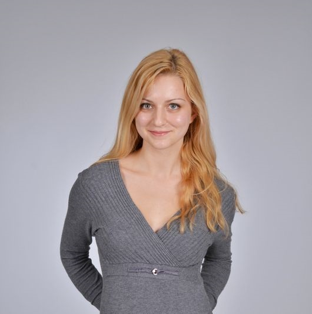

```{r setup, include=FALSE}
knitr::opts_chunk$set(echo = TRUE)
```



I am a postgraduate student in the University of Glasgow's
[Institute of Neuroscience and Psychology](http://www.gla.ac.uk/researchinstitutes/neurosciencepsychology/).
I work with [Dr Christoph Scheepers](https://www.researchgate.net/profile/Christoph_Scheepers).


## Research Interests

My principal research interests lie in the field of Psycholinguistics, including language learning, reading and communication. I would like to commit myself to the research of language-based learning disabilities, such as dyslexia, in order to develop reliable diagnostic tools for early detection of reading impairments and contribute to the establishment of effective interventions to achieve the best possible outcomes for school age dyslexic children.


## Education

2017 - 2018 - University of Glasgow - MSc Research Methods of Psychological Science
Modules included:  Cognitive Brain Imaging Methods, Matlab programming, Statistics, R programming, Research Methods in Cognitive Sciences, Qualitative Methods

2013 - 2017 - University of Glasgow  - BSc (Hons) Psychology
Degree classification:   Upper Second Class Honours, 2:1 
Modules included:   Statistics using R and SPSS, Neuropsychology, Physiological Psychology, Occupational Psychology, Neuropsychological Deficits, Cognitive Psychology, Individual Differences, Perception and Visual Cognition, Research Mini Projects using E-Prime and Matlab
Additional subjects included Archaeology Level 1 and 2, German language Level 1 and 2

2008 - 2013 - Fifth Language School "Yoan Exarch"
Highers: English (A), German (B), History and civilization (A), Mathematics (B), Philosophy (A), Geography and economics (A), Ethics and law (A), Informatics (A), Physics and astronomy (A)


## Professional Appointments

June 2016 - Aug 2016 - Medical Research Scotland - Research assistant

* I was awarded a Vacation Scholarship by Medical Research Scotland (MRS) for my research project titled "The pseudohomophone effect in written word processing: an eye tracking investigation", which I conducted under the supervision of Dr Christoph Scheepers at the University of Glasgow

* Gained experience in advanced statistical modelling techniques (bootstrapping, non-linear curve fitting, mixed effects modelling of response times), in the use of a head-mounted eye tracker (SR Research EyeLink II), as well as in the use of linguistic corpora for stimulus selection and control of confounding factors, such as frequency of occurrence, syllabic structure, orthographic neighbours, N-gram frequencies

* The study is to be submitted to Frontiers in Psychology


## Research Experience

September 2017 – present - Research Assistant for Communication Projects

* Providing assistance in the development of the experimental design and in the statistical analysis of the dissertation projects of undergraduate students. Providing training sessions in the use of a desk-mounted eye-tracking device and the operation of the system Eyelink II.


## Grants and Awards

* 2000 GBP Vacation Scholarship awarded by Medical Research Scotland for my research project titled "The pseudohomophone effect in written word processing: an eye tracking investigation", June - August 2016


## Technical Skills

* Confident in use of statistical packages and programming languages for data analysis: R, SPSS

* Skilled in use of software tools for computerised experiment design and data collection: DMDX, E-Prime

* Extensive experience in use of head-mounted eye tracker device: SR Research EyeLink II


## Research Communication

* Skilled in giving academic and non-specialist presentations and communicating research ideas, participated in the Psychology Undergraduate Conference at the University of Glasgow

* Worked as a personal assistant to a Research Fellow at the University of Glasgow, April 2016 - June 2017. The role involved office work, as well as providing support with presentations and teaching

* Experienced in report writing and writing up research work


## Community Involvement and Outreach

* Cardiac and Respiratory Support volunteer for Chest Heart and Stroke Scotland - completed a First Aid course with the British Red Cross in November 2015, undertook training in techniques and strategies of communication support for individuals with respiratory illness and heart failure

* Volunteered for Karin Dom Foundation - provided communication skills development workshops for children with special needs and their families, provided support through group and individual sessions


## Contact information


#### Address

University of Glasgow 
58 Hillhead Street, 
Glasgow,
G12 8QB

#### Email Address

2068382s@student.gla.ac.uk

#### ORCID ID

<a href="https://orcid.org/0000-0001-9908-2701" target="orcid.widget" rel="noopener noreferrer" style="vertical-align:top;">orcid.org/0000-0001-9908-2701</a>
